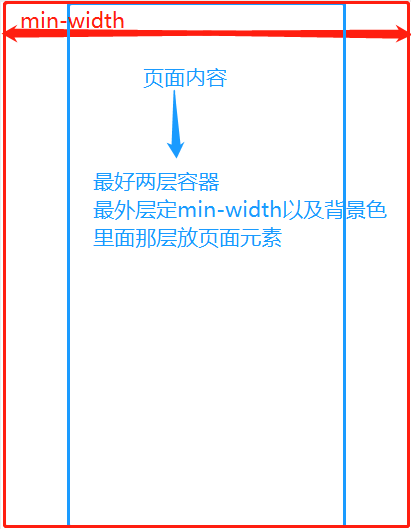

# XiaoMi商城PC端
### 技术栈: HTML + CSS + JavaScript
### 项目预计周期: 2019/10/21 - 2019/10/27
### 完成情况:
##### 一. 首页静态效果+动态功能实现
&emsp;&emsp;  1. 完成商城主页面静态布局</br>
&emsp;&emsp;  2. JS方面</br>
&emsp;&emsp;&emsp;&emsp;  1) 头部搜索框 -> 输入某个关键字匹配到完整光健词</br>
&emsp;&emsp;&emsp;&emsp;  1) 头部产品栏目 -> 鼠标划入划出面板区域高度变化</br>
&emsp;&emsp;&emsp;&emsp;  3) 轮播图模块 -> 轮播效果2种(淡入淡出/无缝轮播)</br>
&emsp;&emsp;&emsp;&emsp;  4) 主体模块 -> 倒计时功能</br>
&emsp;&emsp;&emsp;&emsp;  5) 主体模块 -> 视频播放功能</br>
&emsp;&emsp;&emsp;&emsp;  6) 侧边栏模块 -> 回到顶部</br>
##### 二. 分页未定


### 项目中遇到的问题:
##### 一. 项目布局
&emsp;&emsp;  1. 网页宽度应该怎么设置?</br>
&emsp;&emsp;&emsp;&emsp;  将内容区域划分成若干内容块和间隔模块的方式来辅助排版,譬如:</br>

&emsp;&emsp;&emsp;&emsp;  建议:</br>
&emsp;&emsp;&emsp;&emsp;&emsp;&emsp;  1) 使用以上公式设置网页最小宽度,两边自适应留白</br>
&emsp;&emsp;&emsp;&emsp;  注意:</br>
&emsp;&emsp;&emsp;&emsp;&emsp;&emsp;  2) min/max-width/height与margin-left/right自适应auto不要共用</br>
  
</br>
&emsp;&emsp;&emsp;&emsp;  建议: 首页布局划分成六大块</br>
&emsp;&emsp;&emsp;&emsp;&emsp;&emsp;  1) 顶部导航栏 nav</br>
&emsp;&emsp;&emsp;&emsp;&emsp;&emsp;  2) 头部产品栏 header</br>
&emsp;&emsp;&emsp;&emsp;&emsp;&emsp;  3) 轮播区域 banner</br>
&emsp;&emsp;&emsp;&emsp;&emsp;&emsp;  4) 主体部分 main</br>
&emsp;&emsp;&emsp;&emsp;&emsp;&emsp;  5) 尾部 footer</br>
&emsp;&emsp;&emsp;&emsp;&emsp;&emsp;  6) 侧边工具栏 aside </br>
&emsp;&emsp;  2. 建议一开始将页面上类似模块进行命名归类,避免重代码</br>
&emsp;&emsp;  3. 网站底部关于网站售后以及一系列相关介绍一般情况下用自定义列表进行布局</br>
&emsp;&emsp;  4. 表单元素如何重写样式?首先去除原标签元素身上所有默认样式,其次按一般元素重写样式</br>
&emsp;&emsp;  5. box-shodow/translate3d知识点不熟练</br>
```
/* 阴影水平偏移值 阴影垂直偏移值 阴影模糊值 阴影颜色 */
box-shadow: 0 15px 30px rgba(0,0,0,.1);
/* x,y,z */
transform: translate3d(0,-2px,0);
```
&emsp;&emsp;  6. 几个元素无缝隙排列时,border边框线冲撞问题,不一定非要单个元素拆分去除重复边框线,可以巧用-margin,同理行内块元素清楚默认间距</br>
&emsp;&emsp;  7. 元素与元素之间|隔开,|隔开符可以用伪元素替代元素节点,间距可以优先文本末尾或最前面空格,不一定非要借助CSS样式</br>
&emsp;&emsp;  8. 兄弟元素选择器区别 ~ && +</br>
&emsp;&emsp;&emsp;&emsp;  1) ‘+’选择器则表示某元素后相邻的兄弟元素，也就是紧挨着的，是单个的。</br>
&emsp;&emsp;&emsp;&emsp;  2) ‘~’选择器则表示某元素后所有同级的指定元素，强调所有的。</br>
&emsp;&emsp;  9. 定位元素相对定位父元素设置方位值时,父元素内部padding计算在内,margin不计算</br>

##### 二. JS功能模块
&emsp;&emsp;  1. 头部产品区域 鼠标滑入滑出控制元素高度,为什么原字体的字体形态变了?</br>
&emsp;&emsp;  2. 模拟百度搜索词时,输入结果为空依旧生成新节点</br>
&emsp;&emsp;&emsp;&emsp; 解决: 没有过滤掉文本最前面的空字符串trim()</br>
&emsp;&emsp;  3. 箭头函数的this指向问题</br>
&emsp;&emsp;  4. 回到顶部过快,如何能够以比较平滑的效果回到页面顶部?</br>